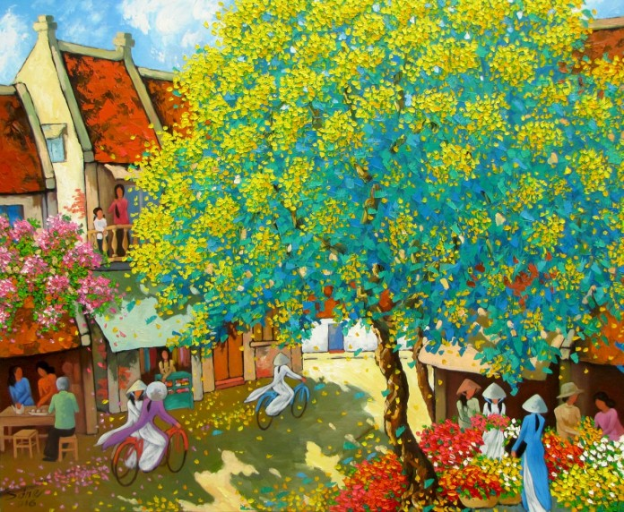
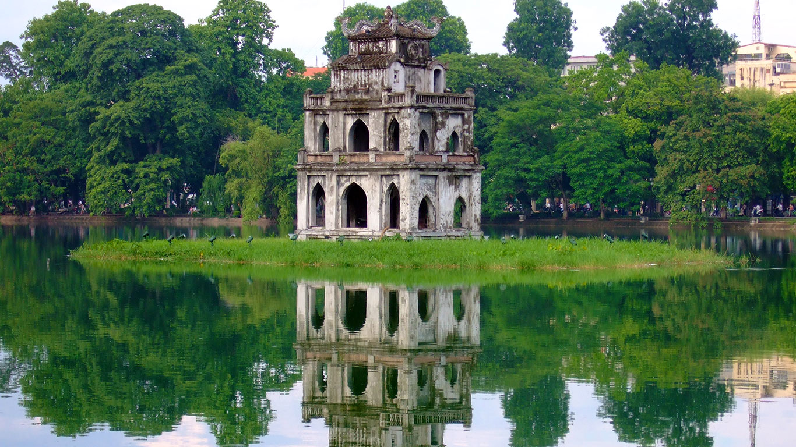

# Fast Neural Style transfer

Pytorch implementation of fast neural style transfer, combination of 3 papers:

[A Neural Algorithm of Artistic Style](https://arxiv.org/abs/1508.06576),
[Perceptual Losses for Real-Time Style Transfer and Super-Resolution](https://arxiv.org/abs/1603.08155),
[Instance Normalization: The Missing Ingredient for Fast Stylization](https://arxiv.org/abs/1607.08022)


*The Great Wave off Kanagawa*




*In the spring* - by [Duong Ngoc Son](http://www.vietnamartist.com/duong-ngoc-son/)




## Usage

### Train

*Skip if you want to have just a quick demo with some pretrained styles*

+ Download COCO 2014 dataset ([link](http://cocodataset.org/#download)),
assume you put in `~/Data/COCO/train2014`

+ Prepare a style image, e.g. `assets/styles/bxphai.jpg`

+ Basic training:

```
python fnst/train.py --dataset ~/Data/COCO/ --style assets/styles/bxphai.jpg
```

+ If you want to tune hyperparameters and number of batch size, epochs, etc.

```
python fnst/train.py --help
```


### Stylize

+ You can train your own or use some pretrained styles:

    + The Great Wave off Kanagawa (`checkpoints/wave.pth`)

    


    + In the spring - by [Duong Ngoc Son](http://www.vietnamartist.com/duong-ngoc-son/) (`checkpoints/dnson.pth`)

    

    +

+ Stylize a content image with a specific style, e.g. style `avatar.jpg` with `dnson` style:

```
python fnst/style.py --content avatar.jpg --model checkpoints/dnson.pth --out out.jpg
```


## References

+ Pytorch's fast neural style example: [link](https://github.com/pytorch/examples/tree/master/fast_neural_style)
